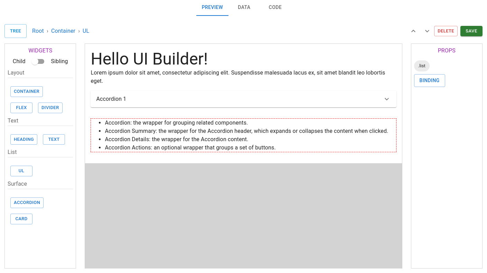

<div align="center">

# UI Builder



</div>

> The UI Builder for ReactJS based on MUI.

## Features

- Simple API
- Data Binding
- Multiple Layouts
- Responsive View
- Accurate Positioning of Widgets

## Upcoming

- Column Layout
- Data Validations
- Edit options like Cut, Copy & Paste of Widgets
- History (Undo & Redo)

> [!NOTE]
> This is mean't to be rendered on sites using Material UI.

> [!TIP]
> You can easily port the renderer to any other UI library, like, Tailwindcss, Chakra UI, etc. 

## Installation

```sh
npm install @tharavugal/ui-builder
```

```sh
yarn add @tharavugal/ui-builder
```

```sh
pnpm add @tharavugal/ui-builder
```

```sh
bun add @tharavugal/ui-builder
```

## Usage

```jsx
import { Builder } from "@tharavugal/ui-builder";

export default function App() {
  const handleSave = (value) => {
    console.log(value);
  };

  return (
    <Builder code={null} data="{}" onSave={handleSave} />
  );
}
```

## License

Copyright (c) [Thanga Ganapathy](https://github.com/Thanga-Ganapathy) ([MIT License](./LICENSE)).